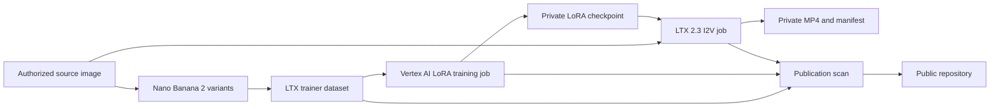

# Architecture

Avatar Video Workbench keeps generated media, cloud credentials, and model
artifacts outside git. The repository stores the control plane: CLI commands,
validation, job staging, manifests, and documentation.



## Repository Boundary

Tracked in git:

- CLI code;
- tests;
- documentation;
- safe templates;
- synthetic demo commands.

Kept outside git:

- source photos;
- generated images;
- generated videos;
- LoRA checkpoints;
- model weights;
- service account files;
- private cloud paths.

## Local Demo Path

The local smoke demo uses synthetic assets and writes them under `/tmp`:

```text
synthetic source image -> dataset manifest -> validation report -> contact sheet -> storyboard
```

That path proves the project wiring without requiring cloud credentials.
